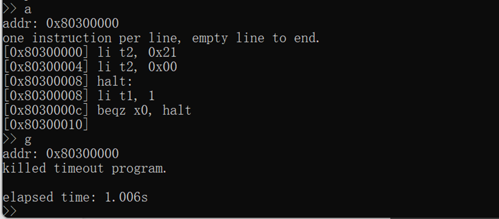

# 五级流水线 RISC-V 处理器实验报告

**编号**：**cod23-grp50    成员**：**范孙奇 邱小轩 周韧平**

[TOC]

## 实验目标

在 ThinPAD-Cloud 实验平台上实现一个支持 RV32I 指令集（及拓展指令）的流水线 CPU，支持中断异常，MMU，以及 ucore 的运行。

## 实验内容

- 支持 RV32I 指令集（及拓展指令）的流水线 CPU
- 支持中断异常机制
- 支持 MMU
- 支持 ucore 运行

## 效果展示

- **中断**
    - **检验超时**：使用 A 指令写入一个死循环程序，使用 G 指令执行
      观察到程序正常完成了中断处理
      
        
    
- **异常**
    - **Syscall打印字符**：
        - 将打印字符的系统调用号 30，保存在 s0 寄存器，字符参数保存在 a0 寄存器。执行 syscall 指令， a0 寄存器的低八位将作为字符打印。
        - 如下图所示，分别将 “O” “K” 对应的 ASCII 码存储到 a0 寄存器，程序可以正确打印字符“OK”
          
            
    
- **虚存 / TLB**
    - 采用 Fibonacci 数列的程序验证虚存及 TLB 机制的正确性：
      
        可以观察到，Fibonacci 前十个数计算正确
        
        
        
        
    
- **iCache**
  
    可以观察到，再次取相同指令时，周期明显缩短
    
    
    
    
    
- **分支预测**
  如下图提前预测了分支，跳转到了 00000034
  
    
  
- **Bypassing**
  
    对比没有数据前传模块（上图）和有数据前传模块（下图）的波形，可以观察到加入数据模块后，插入 bubble 的周期数明显减少，判断为前传成功
    
    
    
    
    
    注：因为时间匆忙 icache / tlb/ bypassing / 分支预测没有合并进主分支
    
- **core**
    - 指令测试：
        - 启动
          
            
            
            
            
            
            
        - faultread
          
            
            
            
            
        - testbss
          
            
            
            
            
        - badsegment
          
            
            
        - yield
          
            
            
        - badarg
          
            
            
        - spin
          
            
            
        - forktree
          
            
            
        - exit
          
            
            
        - forktest
          
            
            
        - priority
          
            
            
        - hello
          
            
            
        - pgdir
          
            
            
        - divzero
          
            
            
        - sleep
          
            
            
        - waitkill
          
            
            
        - faultreadkernel
          
            
            
            
            
        - matrix
          
            
            
            
            
        - sh
          
            
            
        - ls
          
            
            
        - sleepkill
          
            
            
        - softint
          
            （运行之后还是可以正常运行其他命令）
            
            
            

## 实验心得体会

**周韧平**：在学习计算机组成原理的实验过程中，理论知识的掌握是非常重要的。在进行实验前，需要对相关的理论知识进行充分的学习和掌握，包括计算机硬件的基本结构、指令系统、存储器、输入输出等方面的知识，尤其是要仔细阅读RISC-V官方指令集手册中的内容，对于协议的细节要充分地理解再开始写代码。                

**范孙奇**：首先通过计组的实验我体悟到了充分阅读理解文档的重要性，我们需要学会从繁杂的资料中挖掘有用的信息，在脑海中形成一个全盘的理解，这是进行开发之前非常重要的一步；第二点领悟是程序的调试是开发过程中必不可少的一环，正如计组文档开头所说的，“一切 verilog 项目都是仿真驱动开发的”，会不会仿真、对仿真掌握的是否熟练、能否缩短仿真的时间，可以说是能否成功开发出能运行 uCore 的 CPU 的关键。

**邱小轩**：在计组实验中，我学到/领悟到了以下这些造机经验：

- 关注逻辑类型（时序/组合）
- 关注位宽
- 关注读写时序
- 以波形为导向 debug

## 思考题

1. **流水线 CPU 设计与多周期 CPU 设计的异同？插入等待周期（气泡）和数据旁路在处理数据冲突的性能上有什么差异。**
   
    二者对于指令都有相似的处理流程，在子模块的设计（如memory模块，寄存器堆读写等）上也几乎相同，但多周期是把一条指令的执行拆成多个周期完成，通过压缩不同指令的执行周期以提高效率，流水线是在同一时间执行不同指令的不同阶段，从而提高整体的指令执行的效率
    
    在出现数据冲突时，可以通过在流水线中插入气泡来避免冲突，但这样做会降低流水线的执行效率，而数据旁路可以在不增加气泡的情况下解决冲突，相比插入气泡的方法效率更高
    
2. **如何使用 Flash 作为外存，如果要求 CPU 在启动时，能够将存放在 Flash 上固定位置的监控程序读入内存，CPU 应当做什么样的改动？**
   
    首先需要为Flash添加外设接口（需要更改 `wb_mux` 模块，专门为 Flash 开辟一片地址），在CPU启动时，需要将PC初始值设置成 Flash 外设对应的地址区域，这样就可以读取并执行 Flash 上的监控程序了
    
3. **如何将 DVI 作为系统的输出设备，从而在屏幕上显示文字？**
   
    在顶层文件中添加 Block-Ram 和 VGA 模块，并为Block-Ram填加总线上的外设接口和地址，Block-Ram 提供了比 SRAM 更高的访问效率，CPU通过执行指令将需要展示的数据写入 Block-Ram，而VGA模块会轮询扫描 Block-Ram 中的内容，将输出结果显示在屏幕上
    
4. **（虚拟内存）考虑支持虚拟内存的监控程序。如果要初始化完成后用 G 命令运行起始物理地址 `0x80100000` 处的用户程序，可以输入哪些地址？分别描述一下输入这些地址时的地址翻译流程。**
   
    可以输入 `0x00000000` 或者 `0x80100000` ，这两个地址分别会引导cpu去查找表项对应 `0x000` 和 `0x200` 的一级页表，再查找表项对应 `0x000` 和  `0x100` 的二级页表，查找成功最后得到正确的物理地址 `0x80100000`
    
5. **（异常与中断）假设第 `a` 个周期在 ID 阶段发生了 Illegal Instruction 异常，你的 CPU 会在周期 `b` 从中断处理函数的入口开始取指令执行，在你的设计中，`b - a` 的值为？**
   
    在我们的设计中，非法指令会经过 ID-EXE-MEM 阶段，在 MEM 阶段触发非法指令异常，下一阶段从中断处理函数入口取指，因此 `b-a=4`
    

## 遇到的困难与解决方案

- 遇到文档对实现细节描述不清楚的地方，参考RISC-V官方指令集手册 & 和同学交流了解实现细节
- 在 ucore 实验中，使用 verilator 工具仿真 debug，其速度显著快于 vivado 自带的仿真工具

## 数据通路图

下图为我们实现的五级流水线CPU数据通路图（部分信号略去），其中蓝色模块部分为异常处理模块，绿色部分为冲突处理模块


Memory模块内部使用TLB模块以加速页表查询（在最后一版ucore中省去了TLB功能，以避免可能因 `sfence.vma` 指令处理不当产生的错误）


## **模块设计**

### 流水线模块

我们在 pipeline_master.sv 这个文件中实现了五级流水线（IF, ID, EXE, MEM, WB 共五个阶段），这五个阶段分别执行下面的操作：

- IF：从内存或者指令 cache 中读取指令。
- ID：对读取的指令进行译码，判断需要对哪个寄存器进行操作，从通用寄存器中读取操作数。
- EXE：进行 ALU 运算或者计算出要访问的内存地址。
- MEM：访问内存或者数据 cache，获得数据。
- WB：将指令运算或者操作的结果写回到目标寄存器中。

### 异常处理模块

异常处理模块主要由 csr.sv 这个文件实现。

异常处理的流程大致如下：

- 根据当前特权等级、优先级、 `msie` 与 `msip` 的值检查当前是否发生了异常。
- 检查 `mideleg` 与 `medeleg` 寄存器，若这两个寄存器中对应的位为 1，则将异常委托给 S 态，否则委托给 M 态处理。
- 一系列保存当前状态的操作：
    - 将异常原因写到 `mcause` 或者 `scause` 中；
    - 将输入的值写到 `mtval` 或者 `stval` 中；
    - 将当前的 PC 保存至 `mepc` 或者 `sepc` 中；
    - 将当前的特权等级保存至 `msstatus.mpp` 或者 `msstatus.spp` 中；
    - 将当前的 `mstatus.mie`（或 `mstatus.sie`）保存到 `mstatus.mpie`（或 `mstatus.spie`）。
- 将 `mstatus.mie`（或 `mstatus.sie`）设置为 0，禁用中断。
- 跳转至 `mtvec` 或者 `stvec` 给出的要跳转到的异常处理程序的地址，执行异常处理程序。
- 异常处理程序执行完之后，会有异常返回指令（`mret` 或者 `sret` ）。我们需要先进行一系列恢复异常前状态的操作：
    - 将 `mstatus.mie`（或 `mstatus.sie`）恢复为 `mstatus.mpie`（或 `mstatus.spie`）；
    - 将 `mstatus.mpie`（或 `mstatus.spie`）设置为 1；
    - 将 `mstatus.mpp`（或 `mstatus.spp`）恢复为用户态。
- 异常返回，最后跳转至 `mepc` 或者`sepc` 处。

### MMU

MMU的全称是 memory management unit，负责内存的整体管理，主要由 mmu.sv 与 mmu_tlb.sv 这两个文件实现。具体来说，它具有如下功效：

- 决定是否需要进行地址翻译
- 根据快表与页表，将虚拟地址翻译为物理地址
- 进行总线访问，写入/读出数据

MMU 实现的流程大致如下：

- 接受总线传来要访问的地址 `master_addr_in` ，根据 `master_addr_in` 所在的地址范围决定需要访问哪一个设备（SRAM, UART, MTIMER），只有 SRAM 需要进行虚实翻译。
- 再根据 `satp_mode`，决定是否需要进行虚实翻译。
- 若需要进行虚实翻译，则先访问快表 TLB，若命中，则取出虚地址对应的实地址；否则，则进行查询二级页表的操作，取出虚地址对应的实地址。
- 访问实地址，得到数据并返回。

## 数据前传与数据冲突

- 简述数据前传部分的实现逻辑。并给出数据冲突的例子（假设 IF 段和 MEM 段功能可以在 1 周期内完成），以及对应关键信号的波形图。
  
    在遇到写后读冲突时，即当前 ID 译码的寄存器恰好是未来执行指令的写回寄存器（且寄存器非 0 号寄存器）时，将写回内容直接前传给 ID 阶段，以此减少 ID 阶段 bubble 的插入。
    
    在此次大实验中，因为时间原因数据旁路没有 merge 进主分支。遇到数据冲突的例子，我们的方法是插入气泡，以延缓 pipeline 的推进。
    
    例如，下面的例子中，对寄存器 t0 会遇到写后读的数据冲突：
    
    ```nasm
    li t1, 3
    li t2, 5
    li a0, 1
    add t0, t1, t2
    sub a1, t0, a0
    jr ra
    ```
    
    在实际运行中，由于 IF 阶段是多周期的，所以 IF 阶段会插入气泡（见下面的 bubble_IF 波形图），由此解决了这个数据冲突；如果 IF 和 MEM 都可以在一个周期完成的话，那么会在 EXE 阶段插入气泡，从而解决数据冲突。
    
    
    

## 分工情况

- 周韧平：五级流水线整体框架编写、支持异常中断机制、运行 ucore。
- 邱小轩：编写快表、缓存、数据前传模块。
- 范孙奇：编写页表、分支预测模块、额外指令。


